# Autonomous Mobile Automation Agent (agent.js) Architecture

This document outlines the system architecture, design patterns, and operational execution loop of the autonomous mobile agent (`agent.js`).

---

## 1. High-Level Architecture Overview

Unlike the static planner-executor model, the **Autonomous Agent (`agent.js`)** runs a dynamic, closed-loop feedback system. It evaluates the device screen *on the fly* at every single step, allowing it to recover from errors, handle dynamic loading states, and interact with unknown application flows.

```mermaid
graph TD
    User([User Prompt / Goal]) --> Agent[agent.js Core]
    Agent --> Driver[Mobilewright Android Driver]
    Driver --> Device[Target Mobile Device / Emulator]
    
    subgraph Reactive Loop "Repeat until Goal Completed or Max Steps Reached"
        Agent -->|1. Capture| Snapshot[Screen Screenshot + A11y Tree Node Hierarchy]
        Snapshot -->|2. Send| Brain[Local/Remote Vision LLM]
        Brain -->|3. Decide Action| JSON[JSON Response: Thought + Action]
        JSON -->|4. Execute| Action[Mobilewright Smart Action Helpers]
        Action -->|5. Verify State change| Driver
    end
```

---

## 2. The Agent Execution Loop (Step-by-Step)

The agent operates in a continuous **"Capture-Think-Parse-Execute"** loop:

```mermaid
sequenceDiagram
    autonumber
    participant Agent as agent.js Core
    participant Dev as Mobilewright Driver & Device
    participant LLM as Vision LLM (e.g. Ollama)

    rect rgb(30, 41, 59)
        note right of Agent: Loop Step begins
        Agent->>Dev: 1. Request screenshot & Accessibility (A11y) tree
        Dev-->>Agent: Return image (base64) & flat node hierarchy
    end

    rect rgb(15, 23, 42)
        Agent->>LLM: 2. Send System Prompt + Goal + A11y Nodes + Screenshot
        Note over LLM: Evaluates visual screen<br/>& hierarchy layout
        LLM-->>Agent: 3. Return JSON: { thought, action, target, text, coordinates }
    end

    rect rgb(30, 41, 59)
        Agent->>Agent: 4. Parse JSON action & select Mobilewright helper
        alt Action: click/tap
            Agent->>Dev: Call smartTap() or click(x, y)
        else Action: type/input
            Agent->>Dev: Call smartFill() or typeText()
        else Action: scroll/swipe
            Agent->>Dev: Call smartScrollAndTap()
        end
        Dev-->>Agent: Confirmation of physical action execution
    end

    rect rgb(15, 23, 42)
        Agent->>Agent: 5. Verify status (Is "complete" or "failed"?)
    end
```



---

## 3. Technology Stack & Key Layers

### A. The Orchestration Layer (`agent.js`)
* Manages command-line parameter overrides (`-m` model, `--no-vision` mode, `-s` max steps).
* Controls environment variables injection via `.env.test`.
* Orchestrates loop lifetime and exit codes.

### B. The Driver Layer (`mobilewright` & `smart-screen.js` helpers)
Provides high-level abstraction over raw UIAutomator/ADB commands:
* **`smartTap(element)`**: Finds a target node from the accessibility tree (via ID, text, or label) and clicks it. If not found, it falls back to vision coordinate tapping.
* **`smartFill(element, text)`**: Automatically clicks into a text field, clears it, types the requested string, and submits if needed.
* **`smartScrollAndTap(element)`**: Swipes in the appropriate direction until a target element appears, then performs a tap.

### C. The Brain Layer (Vision LLM / Ollama)
Processes the multimodal context:
* **Multimodal Inputs**: Receives the visual screen capture (`png`) along with the accessibility tree string representing layout nodes.
* **Prompt Engineering**: The system prompt instructs the LLM to output a deterministic JSON scheme:
  ```json
  {
    "thought": "The login button is visible at the bottom. I need to click it.",
    "action": "click",
    "target": "login_button_id",
    "coordinates": { "x": 540, "y": 2100 },
    "status": "in_progress"
  }
  ```

---

## 4. Key Advantages for the Team

1. **Error Recovery**: If a button click fails to load a page immediately, the agent sees the same page in the next step, adapts, and retries or scrolls.
2. **Vision-Fallback**: When developers forget to add accessibility labels to UI elements, the agent automatically falls back to visual screen coordinates to perform taps.
3. **Framework Agnostic**: Interacts with the phone via ADB/UIAutomator, meaning it works on Native Android (Java/Kotlin), React Native, Flutter, and WebViews without code changes.
